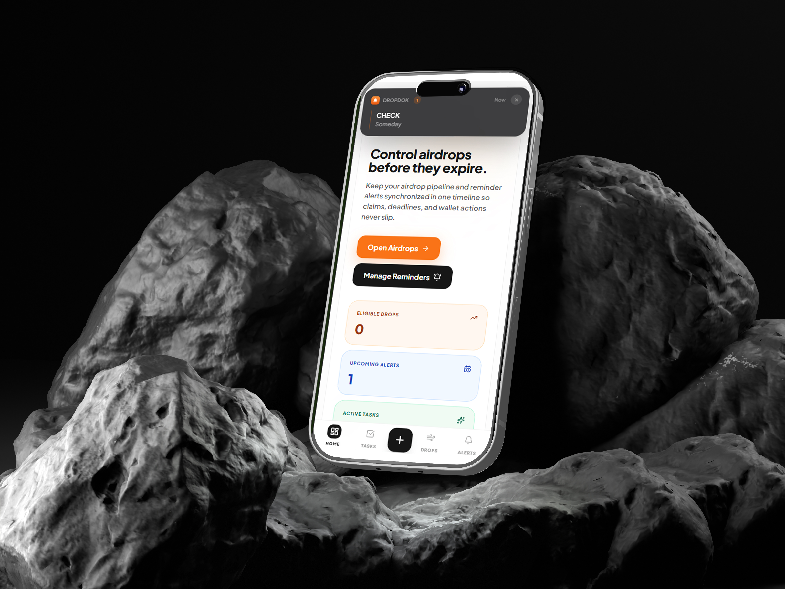

# DropDoK 🚀

A smart productivity web app to manage reminders, notes, and track airdrops — all in one clean and minimal interface.

---

## 🔗 Live Demo
👉 https://dropdok.vercel.app  

---

## ✨ Features

- ⏰ Smart reminder system  
- 📝 Quick notes management  
- 🎁 Airdrop tracking made simple  
- ⚡ Fast and responsive UI  
- 🎯 Clean, distraction-free design  
- 🌐 Works across all devices  

---

## 📸 Preview

### 🖥️ Dashboard / Main Interface

### 📝 Notes & Reminders

### 🎁 Airdrop Tracker

---

## 🛠️ Tech Stack

- Next.js  
- Supabase  
- Vercel  

---

## 🎯 Project Vision

DropDoK is built to simplify daily productivity by combining reminders, notes, and airdrop tracking into a single, easy-to-use platform.  
Focused on clarity, speed, and usability.

---

## 👨‍💻 Creator
**Farhan Kakoki**  

**Kakoki Creative Co.**  
Crafting modern digital experiences.

---

## ⭐ Show Support

If you like this project, consider giving it a ⭐ on GitHub!
